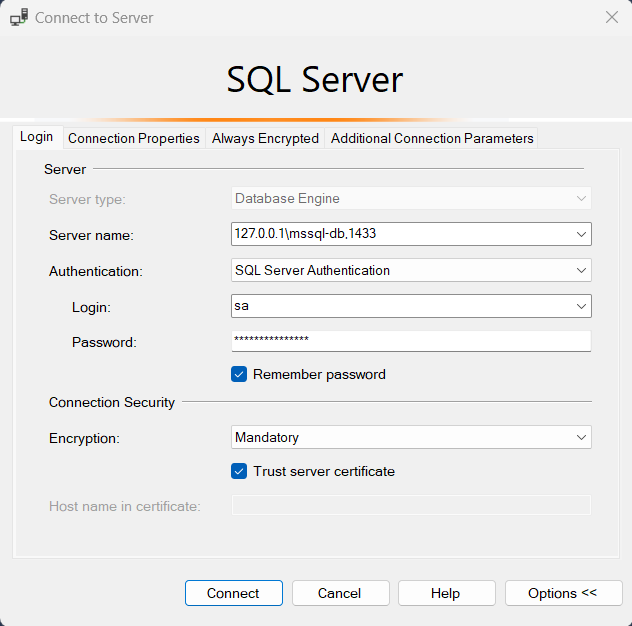
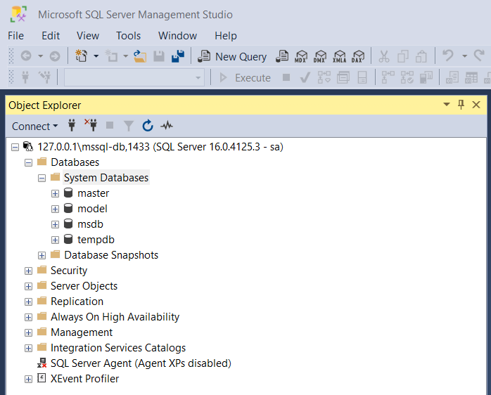

# Run SQL Server 2022 Linux container images with Docker
* https://tuts.heomi.net/run-sql-server-2022-linux-container-images-with-docker/

# Create docker-compose.yml file
* [docker-compose.yml](./docker-compose.yml)
* https://stackoverflow.com/questions/63133630/is-it-possible-to-create-a-volume-with-microsoft-sql-server-docker-container

Then, to prevent permission denied error create data,log and secrets folder and change their permission:
```
mkdir data && sudo chown 10001 data
mkdir log && sudo chown 10001 log
mkdir secrets && sudo chown 10001 secrets
```
# Run the MSSQL-DB container

To start the service
```
$ docker compose up -d
```

To stop the service
```
$ docker compose down
```

# Connect to the SQL Server 2022
* https://stackoverflow.com/questions/61859247/cannot-connect-with-ssms-to-sql-server-on-docker

Open SQL Server Management Studio (SSMS) on your computer and connect the database using the credentials which you set in the `docker-compose.yml` file

What worked for me was connecting as follows:
* `127.0.0.1\{container_name},1433`

I used the following image:
* `mcr.microsoft.com/mssql/server`
With MSSQL_PID Express and ports :
```
"1433:1433"
"1434:1434/udp"
```

Finaly, it works with SSMS:
* Server name: `127.0.0.1\mssql-db,1433`
* Authentication: `SQL Server Authentication`
* Login: `sa`
* Password: `Admin@1234`
* Trust server certificate = True




